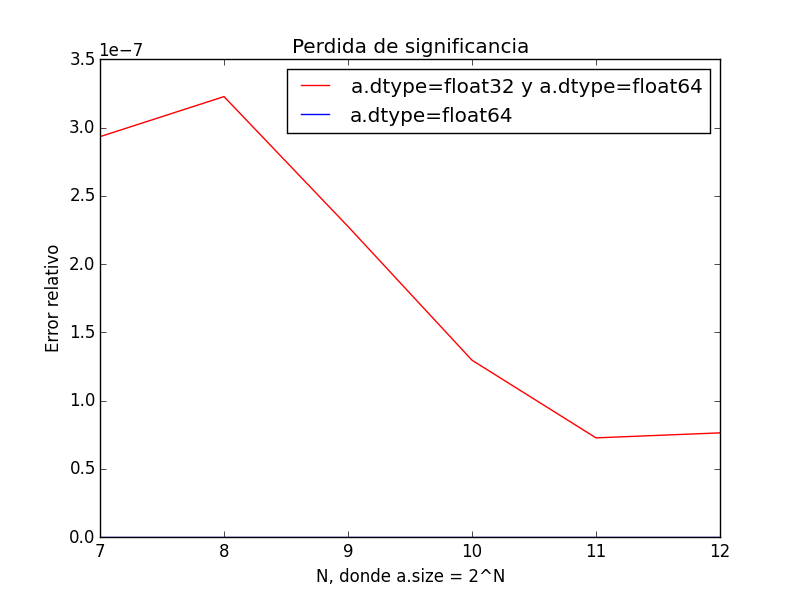

# MCOC-Proyecto-0

MCOC-Proyecto-0

# Introducción 

En este proyecto se ilustrará mediante el ejemplo del cálculo de la esperanza de una función de probabilidad, la pérdida de significancia. 

# Cálculo de la esperanza 

En este ejemplo se utilizará como función de probabilidad f(x) = log(x). La esperanza se define como la sumatoria del valor de la variable por su probabilidad, así se observará como a medida que se aumenta el número de datos el error relativo va cambiando. 
Para esto se definió en python la función esperanza para tres distintos tipos de datos, `dtype=np.float16`, `dtype=np.float32` y por último `dtype=np.float64`. Se consideró como el tipo de datos con mayor presición 'dtype=np.float64' y se calculó el error de los otros dos a partir de este. 

# Output 

Para el cálculo del error relativo se utilizó la siguiente fórmula, 

`ERROR = (Esperanza_Calculado - Resultado_Exacto) / Resultado_Exacto`

A continuación, se presentan los gráficos donde se ilustra los cambios en el error relativo según el uso de datos que se utilizó.

 

 

Se utilizaron dos gráficos debido a que el error al comparar los datos `dtype=np.float36` y `dtype.float64` son números muy pequeños en comparación con el error de los datos `dtype=np.float16` y `dtype.float64` que no se alcanzan a apreciar en un solo gráfico. 

Output de la consola: 

`N = 128`
`Esperanza_1 =  35961.8671875 Error_1 =  -0.00319150616015 %`
`Esperanza_2 = 35963.0150548 Error_2 =  2.93313793364e-07 %`
`Esperanza_3 = 35963.0149493 Error_3 =  0.0 %`


